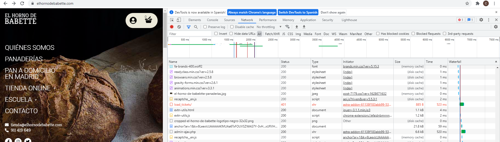
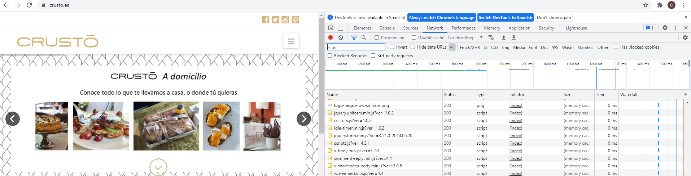
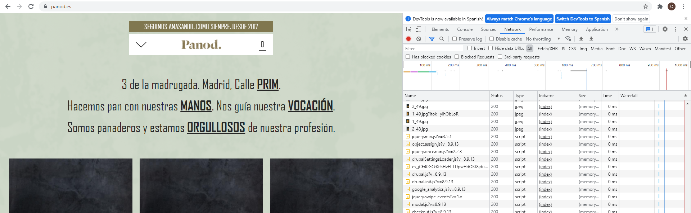

# ***Puntuar paginas:***
## Puntuar:
```
Describe tiempo de carga de cada una de las webs
Errores encontrados en la home
Palabras claves
posicionamiento en buscadores de cada una de las palabras clave
puntuación de 0 a 10 en cuanto a:
    • uso
    • accesibilidad
    • numero de páginas con distinta URL.
```
## Paginas:
```
https://elhornodebabette.com/
https://crusto.es/
https://panod.es/
https://www.pandelirio.es/
https://harinamadrid.com/
https://www.lamagdalenadeproust.com/
https://www.leonthebaker.com/
http://elhorno.net/
```


---

## El horno de babette:

Tardó 6,5 segundos en cargar completamente.


Puntuación de la home: 9
```
La home esta muy bien y no encuentro fallos.
La información sobre la funcion de la pagina web esta clara. 
No hay mucho texto ni muchas imagenes que puedan distraer.
El menu es claro, con los elementos justos.
Contacto visible.
No hay enlaces rotos. 
La navegacion es facil y no hay paginas huerfanas.
```

Titulo y etiqueta descripcion:
```html
<title>El Horno de Babette | Panaderías artesanas en Madrid</title>
	<meta name="description" content="En El Horno de Babette elaboramos pan saludable con masa madre, fermentaciones lentas y harinas molidas a la piedra, y repostería con los mejores ingredientes. Pan hecho en Madrid." />
```


## El horno de crusto:

Tardó algo menos de 1,4 segundos en cargar completamente.


Puntuación de la home: 7
```
Tiene un slider bastante grande ademas, algo que no recomiendan.
Tiene demasiadas imagenes, enlaces, etc..., se produce "efecto megafono".
Demasiadas opciones en los desplegables del menu que ademas que, me parece, no son del todo claras.
Muchas paginas a las que accedes por el menu acaban en paginas que son tambien accesibles al menu. 
Por lo demas, el objetivo de la pagina esta claro, no hay muchos estilos ni fuente, las redes estan visibles, los enlaces
funcionan, etc...

```

Titulo y etiqueta descripcion:
```html
<title>Crustó | Panaderia Madrid y Barcelona | Pasteleria | Cafeteria | Catering | Brunch</title>
```


## Panod:

Tardó menos de un segundo en cargar completamente.


Puntuación de la home:
```
El menu tiene las opciones justas, bien rapartidas y resultan claras.
El texto es escalable.
La función (vender pan) esta clara, la informacion de los productos es facilmente encontable y muy completa.
Las imagenes son muy grandes y hay demasiadas.
La información sobre las redes sociales no esta bien visible, tienes que fijarte para ver que estan dentro de la barra de navegación
y hay información en ella que podría estar en el footer.
El diseño es muy simple, no es muy bonito.
```

Titulo y etiqueta descripcion:
```html
<title>QUICHES | Panod</title>
```

## Pan de Lirio

Tardó 2,2 segundos en cargar completamente.


Puntuación de la home: 9
```
La home esta muy bien y no encuentro fallos.
La información sobre la funcion de la pagina web esta clara. 
No hay mucho texto ni muchas imagenes que puedan distraer.
El menu es claro, con los elementos justos.
Contacto visible.
No hay enlaces rotos. 
La navegacion es facil y no hay paginas huerfanas.
```

Titulo y etiqueta descripcion:
```html
<title>El Horno de Babette | Panaderías artesanas en Madrid</title>
	<meta name="description" content="En El Horno de Babette elaboramos pan saludable con masa madre, fermentaciones lentas y harinas molidas a la piedra, y repostería con los mejores ingredientes. Pan hecho en Madrid." />
```


### Fuentes sobre posible errores en la home:
[HOME 1](https://www.antevenio.com/blog/2017/12/12-errores-que-cometes-en-la-home-de-tu-site/)

[HOME 2](https://www.40defiebre.com/fallos-home-web)
```

```